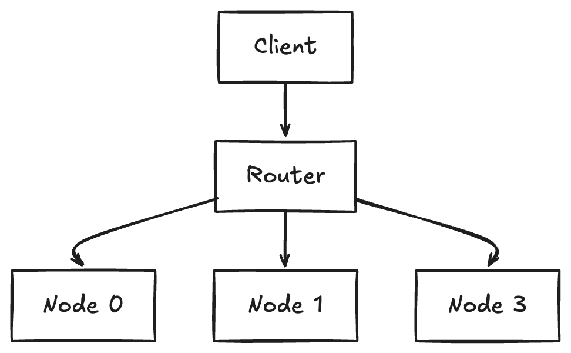
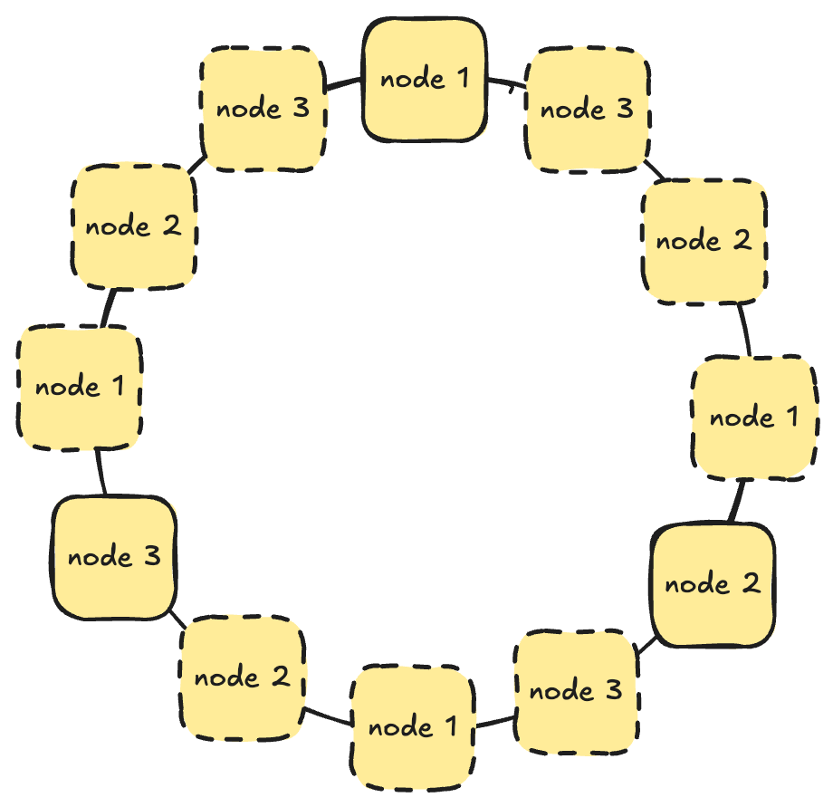

# KV Store

A key-value HTTP service designed for per key atomicity, optimistic concurrency control and horizontal scaling.

## Part 1 — Single Node

### Design

The single node service is an HTTP server backed by an in-memory **sharded concurrent hash map**. The map distributes entries across multiple protected segments (shards), giving us two properties:

1. **Per-key serialization** - writes to the same key acquire the shard's write lock via an entry API, so concurrent mutations on the same key are serialized.
2. **Cross-key parallelism** — keys that hash to different shards proceed concurrently with no contention.

The shard count is configurable at startup (`SHARD_AMOUNT` env var) and must be a power of two.

### Concurrency approach

All mutations go through a single `mutate` method that uses the map's entry API:

- **Occupied entry** — holds an exclusive reference to the entry. The version guard (`ifVersion`) is checked while the lock is held, so there is no gap between reading the version and applying the write.
- **Vacant entry** — inserts a new item at version 1. A vacant entry with a version guard is rejected (returns 409).

### Versioning & optimistic locking

Each key carries a monotonically increasing integer version, starting at 1 on creation and incremented on every successful mutation. Clients can pass `?ifVersion=<n>` on PUT or PATCH as an optimistic check:

- If the current version matches, the write proceeds and version increments.
- If it does not match (or the key doesn't exist for a versioned PUT), the server returns **409 Conflict** with no mutation.

### API

| Method  | Path                    | Description                                                                                                                                                                             |
| ------- | ----------------------- | --------------------------------------------------------------------------------------------------------------------------------------------------------------------------------------- |
| `GET`   | `/kv/{key}`             | Returns `{ key, value, version }` or 404                                                                                                                                                |
| `GET`   | `/kv`                   | Lists all keys (JSON array)                                                                                                                                                             |
| `PUT`   | `/kv/{key}?ifVersion=N` | Full replace. Optional optimistic lock via `ifVersion` query param                                                                                                                      |
| `PATCH` | `/kv/{key}?ifVersion=N` | Upsert/merge. If both existing and incoming values are JSON objects, shallow merges top level fields. Otherwise replaces entirely. Optional optimistic lock via `ifVersion` query param |

### PATCH merge semantics

| Existing value | Incoming delta | Result                                 |
| -------------- | -------------- | -------------------------------------- |
| `{"a":1}`      | `{"b":2}`      | `{"a":1,"b":2}` (shallow merge)        |
| `{"a":1}`      | `"hello"`      | `"hello"` (type mismatch → replace)    |
| Key absent     | any value      | Created with delta as value, version 1 |

### Key tradeoffs

- **Shard level vs per key locks**: Shard level locking is coarser than having a separate lock for each key, so two keys in the same shard can end up waiting on each other. The upside is that it avoids the memory cost of maintaining a lock per key. In this workload, that tradeoff is worth it, since a reasonable shard count keeps contention low.

### Testing

**Unit tests** cover:

- Basic CRUD (get, set, merge on present/absent keys)
- Version guard happy path and stale-version rejection
- Merge semantics (object extend, type mismatch overwrite, vacant key insert)
- Concurrent sets on same key (100 tasks, assert version == 100)
- Concurrent sets on different keys (100 tasks, each key at version 1)
- Concurrent merges on same key (100 tasks, assert version == 101)
- Optimistic lock contention (10 concurrent CAS attempts, exactly 1 wins)
- Mixed concurrent reads and writes (50 writers + 50 readers, no torn reads)

**Integration test**:

- Spins up a real server on a random port.
- 3 HTTP clients each perform 100 read-modify-write increments on the same key using optimistic locking (`?ifVersion=N`). On 409, the client retries from the read.
- Asserts the final counter value is exactly **300**, proving no lost updates.

### Running

```bash
# Start the server
ADDRESS=0.0.0.0:8080 SHARD_AMOUNT=64 cargo run -p kvstore

# Run tests
cargo test -p kvstore
```

## Part 2 — Multi-Node

### Design

A separate **router** process sits in front of N storage node processes. The router is a stateless HTTP reverse proxy that deterministically maps each key to exactly one backend node using **hash-based partitioning** (hash of the key mod number of nodes).



**How routing works**:

- For `GET/PUT/PATCH /kv/{key}`: the router hashes the key, selects the owning node and proxies the request (including query params and body) to that node's `/kv/{key}` endpoint.
- For `GET /kv` (list all keys): the router fans out to every node's `/kv` endpoint in parallel, collects each node's key list and streams back NDJSON (`{"key":"some-key","node":"node-id"}` per line).

**Why a router over client-side partitioning**: a central router keeps the partitioning logic in one place — clients don't need to know about the topology. It also makes it easy to add the list-all-keys fan-out without client changes.

### Preserving Part 1 semantics

Since each key lives on exactly one node, per-key atomicity and versioning are preserved — the owning node handles all concurrency for its keys using the same shard-level entry locking from Part 1. The router is stateless and does no caching.

### Key tradeoffs

- **Single point of failure**: the router is a single point of failure.
- **Static node list**: nodes are configured at router startup. Adding/removing nodes would rehash keys and data would need to be migrated.
- **Fan-out for list keys**: `GET /kv` must query all nodes. Latency is bounded by the slowest node.

### Testing

**Integration tests** spin up 3 kvstore nodes and a router in-process on random ports. They cover:

- Basic CRUD through the router (PUT, GET, overwrite)
- 404 for missing keys
- Optimistic locking on PUT (`ifVersion` match → 200, mismatch → 409)
- PATCH merge semantics (shallow object merge) and version guard (409 on mismatch)
- Fan-out `GET /kv` returns NDJSON with all keys across all nodes
- Routing determinism (same key always hits the same node)
- Concurrent increments (3 clients × 50 read-modify-write loops with optimistic locking, final value = 150)

```bash
# Run router integration tests
cargo test -p kvstore_router

# Run all tests (kvstore + router)
cargo test
```

### Running (multi-node)

#### With Cargo

```bash
# Terminal 1-3: start 3 storage nodes
ADDRESS=0.0.0.0:7001 SHARD_AMOUNT=64 cargo run -p kvstore
ADDRESS=0.0.0.0:7002 SHARD_AMOUNT=64 cargo run -p kvstore
ADDRESS=0.0.0.0:7003 SHARD_AMOUNT=64 cargo run -p kvstore

# Terminal 4: start the router
ADDRESS=0.0.0.0:7000 NODES=http://127.0.0.1:7001,http://127.0.0.1:7002,http://127.0.0.1:7003 cargo run -p kvstore_router
```

#### With Docker Compose

```bash
# Start the full cluster (3 nodes + router)
docker compose up --build

# Stop the cluster
docker compose down
```

## Part 3 — Technical Roadmap

### Motivation

Part 2 uses `hash(key) % N` to assign keys to nodes. This works with a fixed node count, but adding or removing a node basically requires a full data migration. In most production systems, we'd probably need the ability to scale the cluster up or down without major disruption.

### Current problem

With simple modulo hashing and 3 nodes, adding a 4th node changes the assignment of ~75% of keys:

```
key "user:42"  →  hash % 3 = Node 1  →  hash % 4 = Node 2  (moved)
key "user:99"  →  hash % 3 = Node 0  →  hash % 4 = Node 3  (moved)
key "user:7"   →  hash % 3 = Node 1  →  hash % 4 = Node 1  (stayed)
```

### High-level design

Replace modulo hashing with consistent hash ring + virtual nodes.



1. Each node gets a set of virtual nodes placed at hashed positions on a ring.
2. To route a key, hash it and walk clockwise to the first virtual node, that virtual node's physical node handles the key.
3. When a new node joins, it takes ownership of key ranges from its neighbors. Only keys in those ranges needs to be migrated.
4. When a node leaves, its key ranges are absorbed by the next clockwise neighbors, this reduces the amount of data that needs to be migrated (compared to having to migrate all data using simple modulo hashing).

### Key migration during scaling

When the ring changes, the router needs to migrate affected keys:

1. Router computes the old and new ring assignments.
2. For each affected key range, the router reads keys from the old owner via `GET /kv` and writes them to the new owner via `PUT /kv/{key}`.

### Benefits

- **Minimal disruption on scale events**: adding a node moves only a fraction of the key.
- **Uniform load distribution**: virtual nodes smooth out imbalances from uneven hashing.
- **No client changes**: the router handles all ring logic internally.

### Tradeoffs

- **Lookup complexity**: Slight lookup complexity where the lookup time is now O(log V) where V := number of virtual nodes
- **Migration complexity**: Key transfer during changes requires more coordination.
- **Tuning complexity**: Too few virtual nodes leads to uneven distribution and too many increases ring lookup overhead and memory.

### Rough effort

1. **Hash ring implementation** - Implement using sorted list of virtual node positions with binary search for key lookup.
2. **Router integration** - Replace modulo routing with consistent hashing + virtual nodes.
3. **Data migration** - Compute affected ranges, transfer keys between nodes.
4. **Tuning** - Verify key distribution uniformity and use load tests to tune virtual node count .
